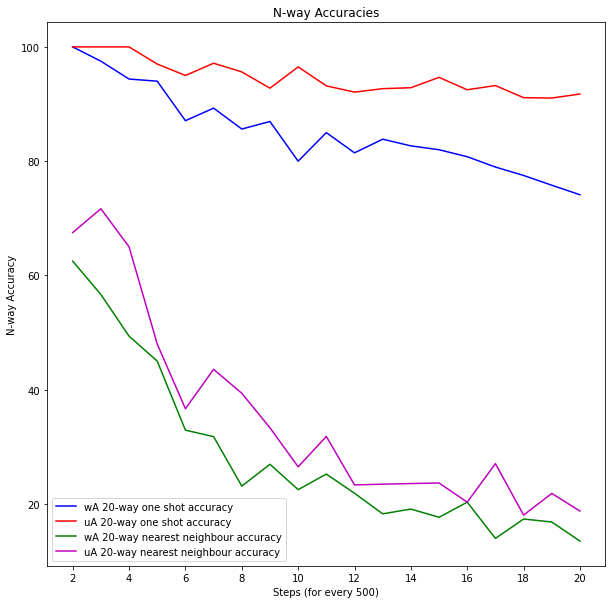

# Siamese Neural Networks for One-shot Image Recognition

Here we will implement the paper http://www.cs.cmu.edu/~rsalakhu/papers/oneshot1.pdf

For Theoretical Explanation , check out my post on medium: https://medium.com/@asagar60/one-shot-learning-using-keras-8c1cd62ac382

## Brief Description

Our model is given a tiny labelled training set S, which has N examples, each vectors of the same dimension with a distinct label y.

It is also given x_test, the test example it has to classify. Since exactly one example in the support set has the right class, the aim is to correctly predict which y ∈ S is the same as x_test’s label.

But the problem becomes challenging when N increases. Now we have to compare our test image with N different images and look for the highest probability for the correct class.

## Evaluation Strategy

There are two different ways to obtain few-shot classification problems for testing an algorithm. We will refer to these as "within-alphabet" and "unstructured" evaluation. The difference lies in how a random set of K classes is obtained:

To have better accuracy of the model , we will test the model on "Within Alphabet" and "unstructured Alphabet" Pairs. This strategy is inspired by Jack Valmadre's few-shot classification repo - https://github.com/jvlmdr/omniglot-eval

- **within-alphabet** : Choose an alphabet, then choose K characters from that alphabet (without replacement).
- **unstructured** : Concatenate the characters of all alphabets, then choose K characters (without replacement). The hierarchy of alphabets and characters is ignored.

Intuitively, we might expect that the unstructured problem is easier, because there is likely to be more variation between alphabets than within alphabets. (This may seem counter-intuitive since characters within an alphabet must be different from one another, whereas characters across alphabets may be identical. However, a character in one alphabet can have at most one such near-identical match in another alphabet.)

## Output

| Acc    | Within Alphabet (20-way) | Unstructured Alphabet (20-way) |
|--------|-----------------------|--------------------------|
|Validation set  | 78.0 %| 91.0% |
|Evaluation Set (10 Alphabets) | 78.0 %| 89.0 %|
|Evaluation Set (20 Alphabets) | 74 %                | 91.0 %                   |

### Training Accuracy and Training Loss

### One Shot Accuracy on Validation Set

### One Shot Accuracy on Test Data

## Detailed Accuracies

| Acc    | Acc - wA pairs | NN Acc - wA pairs | Acc - uA pairs | NN Acc - uA pairs |
|--------|-----------------------|--------------------------|-----------------------|--------------------------|
| N = 2  | 100.0 %               | 62.5 %                   | 100.0 %               | 67.5 %                   |
| N = 5  | 94.0 %                | 45.0 %                   | 97.0 %                | 48.0 %                   |
| N = 6  | 87 %                  | 32.9 %                   | 95.0 %                | 36.6 %                   |
| N = 10 | 80.0 %                | 22.5 %                   | 96.5 %                | 26.5 %                   |
| N = 15 | 82.0%                 | 17.6 %                   | 94.6%                 | 23.6 %                   |
| N = 16 | 80.78 %               | 20.3 %                   | 92.5 %                | 20.31 %                  |
| N = 20 | 74.12%                | 13.5%                    | 91.75 %               | 18.75 %                  |

*Note* : These accuracies are from Evaluation Set ( 20 Alphabets).
* wA_Acc == Within Alphabet Accuracy 
* uA_Acc == Unstructured Alphabet Accuracy 
* NN Acc ==  1 - Nearest Neighbour Accuracy

## Visualize 20-way pairs

**Within Alphabet Pairs**

**Unstructured Alphabet Pairs**

## Implementation Details

- **Load Data** :

    We will load the data into pickle file .

    Training Set has 964 classes with 20 samples in each class. Model needs 2 images to predict the output . If we train our model on every possible combination of image pair , this will be over by 185,849,560 possible pairs.

    We can reduce the number of image pairs. Since every class has 20 samples, say E, that makes E(E-1)/2 image pairs (same) per class .
    If there are C classes that makes C* E(E-1)/2 image pairs in total. These images represent same-class image pairs. For 964 classes , there will be 183,160 same image pairs.

    We still need different-class image pairs. The siamese network should be given a 1:1 ratio of same-class and different-class pairs to train on. So, we will sample 183,160 image pairs (different-class) at random.

    Paper suggested different sizes of training data ( 30K, 90K, 150K, 270K, 810K, 1350K ).

- **Evaluation Set**:

    We need to have image pairs for " Within Alphabet and Unstructured Alphabet" for both validation and Evaluation Set.

    We will split the default evaluation set into validation and Evaluation set.

    The original Omniglot github repo uses within-alphabet evaluation. It defines 20 runs, each of which comprises 20 training images and 20 testing images from the same alphabet (2 runs for each of the 10 evaluation alphabets.

    So , We split the data based on Alphabet sets used in these 20 runs.
    These are namely **['Atlantean', 'Ge_ez', 'Glagolitic', 'Gurmukhi', 'Kannada', 'Malayalam', 'Manipuri', 'Old_Church_Slavonic_(Cyrillic)' ,'Tengwar','Tibetan']** which we save as 10 split ( 10 Alphabet) evaluation set

    So we define :

    * wA_val_10_split_images.pkl   : within alphabet pairs for validation set (10 Alphabets)
    * uA_val_10_split_images.pkl   : Unstructured alphabet pairs for validation set (10 Alphabets)
    * wA_eval_10_split_images.pkl  : within alphabet pairs for Evaluation set (10 Alphabets)
    * uA_eval_10_split_images.pkl  : Unstructured alphabet pairs for Evaluation set (10 Alphabets)
    * wA_eval_20_split_images.pkl  : within alphabet pairs for Evaluation set (20 Alphabets)
    * uA_eval_20_split_images.pkl  : Unstructured alphabet pairs for Evaluation set (20 Alphabets)

- **Training Strategy** :

    I trained the model for 500000 iterations where each iterations corresponds to batch training and evaluating the model for every 500 epochs ( when trained on 500 batches).

    Optimizer used here is SGD with initial learning rate as 0.001 and initial momentum as 0.5. Learning rate were decayed by 1 percent per 5000 iterations. ( Paper suggested decaying learning rate per epoch, where epoch here corresponds to 1 iteration over the training set, which is almost same as our approach). We linearly increase the momentum by 0.01 per 5000 iterations till it converges to 0.9.

    Accuracy on both within alphabet and Unstructured alphabet pairs were pretty good. Observed around 78% on Within alphabet and 91 % on unstructured alphabet pairs ( 20-way ) when tested on validation set

- **L2 over L1** :

    Paper suggested using L1 distance while designing the model, but I got slightly better result on L2 distance. On L1 accuracy was around 72.75% on Within alphabet and 86 % on unstructured alphabet pairs.

    I saw other Implementations where they prefer Adam optimizer over SGD, but I got better results on SGD.

    | Optim | SGD                            | Adam                            |
    |-------|--------------------------------|---------------------------------|
    | L1    | wA_Acc : 72%  uA_Acc : 86%     | wA_Acc : 63 %  uA_Acc : 78%  |
    | L2    | wA_acc : 78%  uA_Acc : 91%     | wA_Acc : 71 %  uA_Acc : 82%  |

    * wA_Acc == Within Alphabet Accuracy (20-way)
    * uA_Acc == Unstructured Alphabet Accuracy (20-way)

    This difference in accuracy may be has to do with the struture of training and validation set we prepared.

## Future Work

There are few Implementation details mentioned in the paper, that could drastically improve the model's performance, ex - differential learning rate on layers.
In the research paper, they presented a model with wA Accuracy around 92%. 

- [x] Create Base model
- [x] Compare L1 vs L2 results
- [x] Compare SGD vs Adam results
- [x] Model Implementation
- [ ] Implementation of differential learning rate (layer wise learning) to improve accuracy
- [ ] Check with different training sizes

## References

1. [One-Shot learning for face recognition by Andrew Ng](https://www.youtube.com/watch?v=96b_weTZb2w)
2. [Siamese Neural Networks for One-shot Image Recognition](http://www.cs.cmu.edu/~rsalakhu/papers/oneshot1.pdf)
3. [One shot learning by Soren Bouma](https://sorenbouma.github.io/blog/oneshot/)
